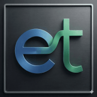
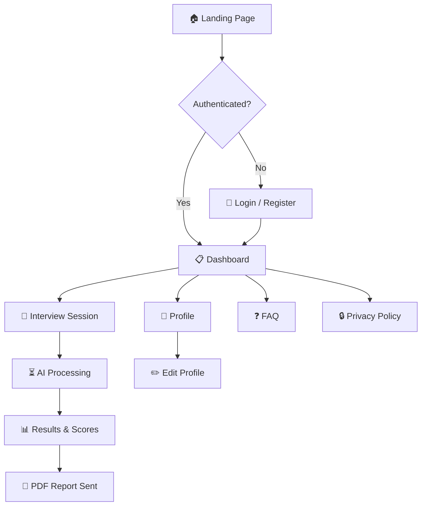
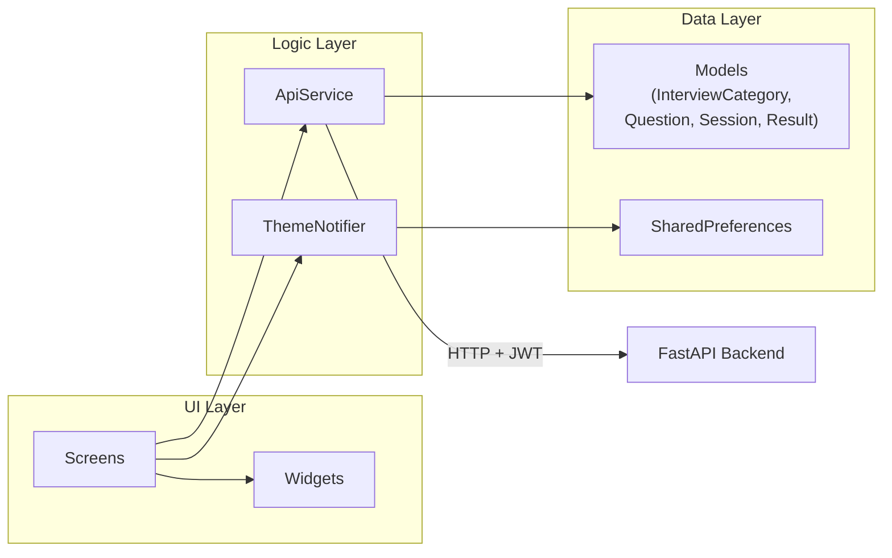

<div align="center">
  
  <h1>Entrevista't — Frontend</h1>

  <p>
    Plataforma de preparació d'entrevistes amb IA · Flutter web & mobile
  </p>

  <p>
    
    
    
    
  </p>

  <h4>
    <a href="https://github.com/Entrevista-t/Front/issues/">Report Bug</a>
    <span> · </span>
    <a href="https://github.com/Entrevista-t/Front/issues/">Request Feature</a>
    <span> · </span>
    <a href="https://github.com/Entrevista-t/Front/pulls">Contribute</a>
  </h4>
</div>

<br />

---

## Table of Contents

- [Disclaimer](#disclaimer)
- [About the Project](#about-the-project)
  - [User Flow](#user-flow)
  - [Key Features](#key-features)
  - [Screenshots & Visual Style](#screenshots--visual-style)
- [Architecture](#architecture)
  - [Screens](#screens)
  - [Reusable Widgets](#reusable-widgets)
  - [Theme & Design System](#theme--design-system)
  - [Routing](#routing)
  - [Service Architecture](#service-architecture)
- [Tech Stack](#tech-stack)
- [Requirements](#requirements)
- [Getting Started](#getting-started)
  - [Docker (Recommended)](#docker-recommended)
  - [Local Flutter](#local-flutter)
- [Available Commands](#available-commands)
- [CI/CD](#cicd)
- [Project Structure](#project-structure)
- [Configuration](#configuration)
- [Contributing](#contributing)
- [License](#license)

---

## Disclaimer

This project is under active development as part of an academic initiative. Features, UI, and APIs may change without notice. The backend (FastAPI + PostgreSQL) lives in a [separate repository](https://github.com/Entrevista-t/Back) and is required for full functionality — without it, the app falls back to mock/offline data.

---

## About the Project

**Entrevista't** is an AI-powered interview practice platform where users pick a job category, answer timed questions on camera, and receive automated feedback with scores and a downloadable PDF report.

All user-facing text is written in **Catalan (Català)**. Code, comments, and documentation are in English.

### User Flow



### Key Features

- 🎥 **On-camera interview simulation** — timed questions with live camera preview and multi-camera toggle
- 🤖 **AI-powered evaluation** — automated scoring and personalised feedback per answer
- 📊 **Results dashboard** — animated score circles, performance charts, and detailed breakdowns
- 📄 **PDF reports** — downloadable report sent to the user's email
- 🌗 **Light & dark themes** — system-aware with manual toggle
- 🎓 **Onboarding tutorial** — 4-slide carousel guiding first-time users through the interview flow
- ❓ **FAQ page** — 8 questions & answers in Catalan with animated accordion
- 🔒 **Privacy policy** — GDPR-compliant, 10 sections in Catalan
- 📱 **Responsive** — works across desktop, tablet, and mobile browsers

### Screenshots & Visual Style

The app follows a **glassmorphism** design language:

- Frosted-glass cards with `BackdropFilter` blur and semi-transparent backgrounds
- Animated dot-grid backgrounds with radial glow orbs
- Stagger-in entrance animations and floating card effects
- **Gambetta** (serif) for headlines, **Satoshi** (sans-serif) for body text, **Noto Sans** as fallback
- Indigo (`#6366F1`) as the primary accent colour

---

## Architecture

### Screens

| Screen | Route | Description |
|--------|-------|-------------|
| Landing | `/landing` | Hero page with animated floating testimonial cards and footer links |
| Login / Register | `/login` | Glassmorphism auth card with sign-in ↔ sign-up toggle |
| Dashboard | `/home` | Job categories (6 default) and past session history |
| Interview | `/interview/:categoryId` | Camera feed, countdown timer, question flow, onboarding tutorial |
| Results | `/results/:sessionId` | AI scores, animated charts, performance breakdown |
| Report Sent | `/report-sent/:sessionId` | Confirmation after PDF delivery with particle animation |
| Profile | `/profile` | User stats, session history list |
| Edit Profile | `/profile/edit` | Name & email form |
| FAQ | `/faq` | 8 animated accordion items in Catalan |
| Privacy Policy | `/privacy` | 10-section GDPR page in Catalan |

### Reusable Widgets

| Widget | Purpose |
|--------|---------|
| `DotGridBackground` | Animated radial dot pattern with optional glow orbs |
| `FloatingGlassCard` | Glassmorphism card with floating translate + rotate animation |
| `GlassContainer` | Static frosted-glass container |
| `FaqAccordionSection` | Expandable FAQ item with chevron rotation |
| `OnboardingDialog` | 4-slide PageView carousel tutorial for the interview flow |
| `HomeTutorialOverlay` | Guided spotlight overlay for the dashboard — highlights widgets with tooltip cards |
| `AppCard` | Standard card with optional hover elevation |
| `AppEmptyState` | Icon + message placeholder for empty views |
| `AppSectionHeader` | Section title row with optional trailing action (also exports `AppLabel` and `AppChip`) |
| `GlowIcon` | Tinted icon in rounded square with radial glow |
| `ScoreBadge` | Circular animated score indicator (colour-coded) |
| `SessionTile` | List tile for an interview session entry |

### Theme & Design System

Centralised in `lib/theme/` with three files:

| File | Exports | Description |
|------|---------|-------------|
| `app_colors.dart` | `AppColors` | `ThemeExtension` with light + dark palettes, gradients, score colours |
| `app_spacing.dart` | `AppSpacing` | Spacing tokens, radii, shadows, durations, curves |
| `app_theme.dart` | `AppTheme`, `ThemeNotifier` | `ThemeData` builder and `ValueNotifier` for live mode switching |

Access anywhere via the extension: `context.colors.bgBase`, `context.colors.textPrimary`, etc.

### Routing

Routing uses **GoRouter v14** defined in `main.dart`. All route transitions use a consistent fade animation (250 ms forward, 200 ms reverse).

A dev bypass (`kDevBypassLogin = true`) skips authentication and redirects `/` to `/landing` for UI development.

### Service Architecture



`ApiService` handles all HTTP communication, JWT token storage, automatic session expiry, and result polling (retries up to 30 × 2 s while the backend runs AI analysis).

---

## Tech Stack

| Layer | Technology |
|-------|-----------|
| Framework | Flutter 3.27.1 (Dart ≥ 3.6) |
| Routing | GoRouter 14.6 |
| Camera | `camera` plugin |
| Charts | fl_chart |
| HTTP | `http` + `http_parser` |
| Storage | SharedPreferences |
| File picking | file_picker |
| External links | url_launcher |
| Permissions | permission_handler |
| Backend | FastAPI + PostgreSQL *(separate repo)* |
| Dev server | Docker + Flutter web-server |
| Production | Docker + Nginx Alpine |
| CI/CD | GitHub Actions → GHCR → Docker Swarm |

---

## Requirements

- **Docker** (recommended) — Docker Desktop or Docker Engine
- **Or** Flutter SDK ≥ 3.27.1 with web support enabled
- A running instance of the [Entrevista't backend](https://github.com/Entrevista-t/Back) for full functionality

---

## Getting Started

### Docker (Recommended)

1. **Clone the repository:**

```bash
git clone https://github.com/Entrevista-t/Front.git
cd Front
```

2. **Create an `.env` file** with the backend URL:

```env
API_URL=http://localhost:5000
```

3. **Use the interactive launcher:**

```powershell
./start.ps1
```

This opens a menu with all common tasks (dev server, prod build, tests, APK build, etc.). Choose **option 1** to start the dev server with hot reload at `http://localhost:8080`.

Or start manually:

```bash
docker-compose -f docker-compose-dev.yml up -d --build
```

### Local Flutter

```bash
flutter pub get
flutter run -d web-server --web-port 8080 --dart-define=API_URL=http://localhost:5000
```

---

## Available Commands

All commands can be run via `./start.ps1` or directly:

| Task | Command |
|------|---------|
| **Dev server** (hot reload) | `docker-compose -f docker-compose-dev.yml up -d --build` |
| **Production build** | `docker build --build-arg API_URL=<url> -t entrevistat .` |
| **Run tests** | `docker run --rm -v "${PWD}:/app" -w /app ghcr.io/cirruslabs/flutter:3.27.1 bash -lc "flutter pub get && flutter test"` |
| **Lint / analyse** | `docker run --rm -v "${PWD}:/app" -w /app ghcr.io/cirruslabs/flutter:3.27.1 bash -lc "flutter pub get && flutter analyze"` |
| **Build APK** | `flutter build apk --release --dart-define=API_URL=<url>` |
| **View logs** | `docker logs -f flutter_hot_reload` |
| **Stop containers** | `docker-compose -f docker-compose-dev.yml down` |

### `start.ps1` Menu

| # | Option |
|---|--------|
| 1 | Run DEV mode (hot reload on `:8080`) |
| 2 | Run PROD mode (Nginx on `:8080`) |
| 3 | View live logs |
| 4 | Stop all containers |
| 5 | Run tests |
| 6 | Build Android APK |
| 7 | Generate app icons |
| 8 | Exit |

---

## CI/CD

The repository ships with a GitHub Actions workflow (`.github/workflows/deploy-prod.yml`) that automates production deployments:

1. **Trigger** — push to `main`
2. **Build** — multi-stage Docker image with the production `API_URL` baked in
3. **Push** — image is pushed to GitHub Container Registry (GHCR)
4. **Deploy** — SSH into the production swarm manager and update the running service

---

## Project Structure

```
Front/
├── assets/
│   ├── fonts/
│   │   ├── Gambetta/          # Serif — headlines
│   │   ├── Satoshi/           # Sans-serif — body text
│   │   └── Noto/              # Noto Sans — fallback / secondary
│   └── images/
│       ├── logo_entrevistat.png
│       └── avatar_1–9.png     # User avatars
├── lib/
│   ├── main.dart              # Entry point, routes, theme toggle
│   ├── models/                # Data models (fromJson, fallback/mock)
│   ├── screens/               # 10 routed screen widgets
│   ├── services/              # API service (HTTP, auth, polling)
│   ├── theme/
│   │   ├── app_colors.dart    # Light + dark colour palettes
│   │   ├── app_spacing.dart   # Spacing, radius, shadow tokens
│   │   └── app_theme.dart     # ThemeData builder, ThemeNotifier
│   └── widgets/               # 12 reusable UI components
├── web/                       # Flutter web shell (index.html, manifest, icons)
├── test/                      # Widget tests
├── Dockerfile                 # Production (multi-stage → Nginx)
├── DockerfileDev              # Development (hot reload)
├── docker-compose-dev.yml     # Dev compose config
├── nginx.conf                 # Nginx SPA fallback config
├── start.ps1                  # Interactive PowerShell launcher
├── pubspec.yaml               # Dependencies & asset declarations
└── .github/
    ├── copilot-instructions.md
    └── workflows/
        └── deploy-prod.yml    # CI/CD: build → GHCR → Docker Swarm deploy
```

---

## Configuration

| Variable | Where | Purpose |
|----------|-------|---------|
| `API_URL` | `.env` / `--dart-define` | Backend API base URL |
| `kDevBypassLogin` | `lib/main.dart` | Skip auth for UI development (`true` / `false`) |

The `.env` file is read by Docker Compose and `start.ps1`. For local Flutter development, pass the URL via `--dart-define=API_URL=...`.

---

## Contributing

1. Fork the repository
2. Create a feature branch (`git checkout -b feature/amazing-feature`)
3. Commit your changes (`git commit -m 'Add amazing feature'`)
4. Push to the branch (`git push origin feature/amazing-feature`)
5. Open a Pull Request

Please ensure `flutter analyze` reports **0 issues** before submitting.

---

## License

This project is licensed under the [GNU Affero General Public License v3.0](LICENSE).

You are free to use, modify, and distribute this software under the terms of the AGPL-3.0. Any modified version that is accessible over a network must also be made available under the same license.

See the [LICENSE](LICENSE) file for the full text.
